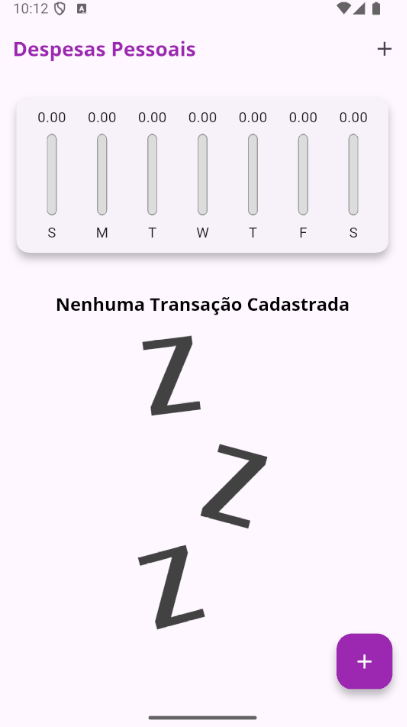
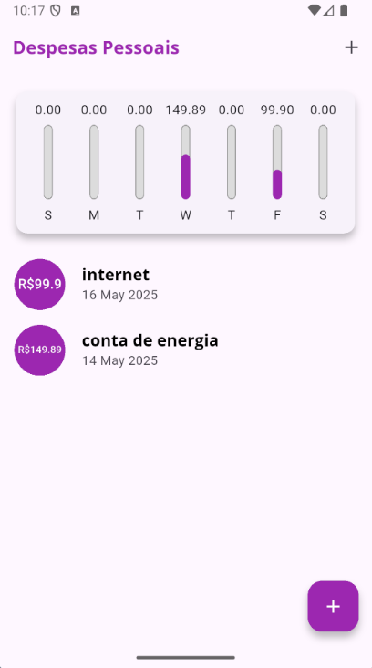
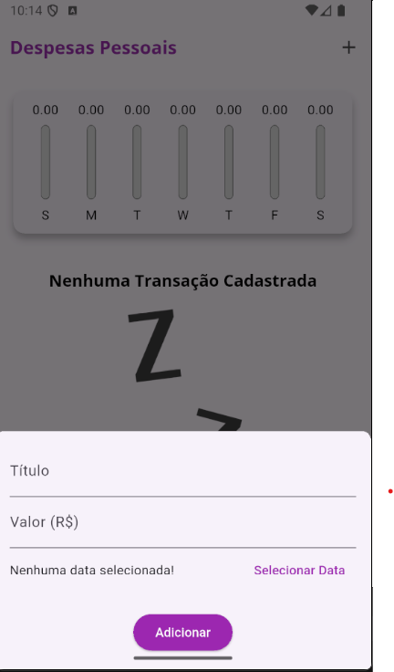

# 💸 Expenses App

Um aplicativo de controle de despesas pessoais desenvolvido com Flutter.

## 📱 Visão Geral

O **Expenses App** permite ao usuário:
- Adicionar novas transações com título, valor e data
- Visualizar uma lista de transações
- Excluir ou editar uma transação existente
- Visualizar um gráfico com os gastos dos últimos 7 dias
- Alternar entre gráfico e lista no modo paisagem

## 🛠 Tecnologias Utilizadas

- [Flutter](https://flutter.dev/)
- [Dart](https://dart.dev/)
- [intl](https://pub.dev/packages/intl) — formatação de datas e moeda
- [uuid](https://pub.dev/packages/uuid) — geração de IDs únicas
- Material Design

## 📂 Estrutura de Pastas

```
lib/
├── components/        # Widgets reutilizáveis como Chart, TransactionForm, TransactionList
├── models/            # Modelo de dados da transação
└── main.dart          # Ponto de entrada da aplicação
```

## ▶️ Como Executar

1. **Clone o repositório:**

```bash
git clone https://github.com/RafaellaBarbosa/expenses_app.git
cd expenses_app
```

2. **Instale as dependências:**

```bash
flutter pub get
```

3. **Execute o app:**

```bash
flutter run
```

## 📝 Funcionalidades Extras

- ✅ Edição de transações diretamente pelo modal de formulário
- ✅ Interface adaptável para orientação paisagem
- ✅ Validação de formulário ao adicionar ou editar despesas

## 📷 Capturas de Tela

### 🏠 Tela inicial






## 🧑‍💻 Autor

Desenvolvido por [Rafaella Barbosa Costa](https://www.linkedin.com/in/rafaella-costa/)
